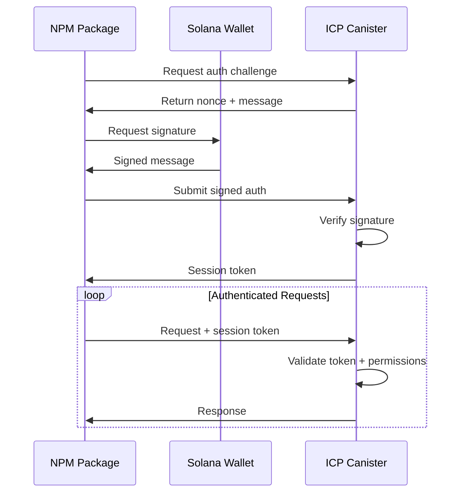

# 🔐 OuroC Security Architecture

## Overview

This document outlines the comprehensive security model for OuroC, ensuring that the ICP canister can only be configured by authorized Solana addresses while keeping the npm package customizable on the payment side but locked down on canister communication.

## 🎯 Security Objectives

1. **Canister Access Control**: Only authorized Solana addresses can configure timers and notifications
2. **NPM Package Security**: Payment logic customizable, canister communication locked down
3. **Authentication**: Cryptographic proof of Solana address ownership
4. **Authorization**: Granular permissions for different operations
5. **Rate Limiting**: Prevent abuse and DoS attacks
6. **Session Management**: Secure, time-bound access tokens

## 🏗️ Multi-Layer Security Architecture

### Layer 1: Cryptographic Authentication
- **Solana Message Signing**: Users must sign challenges with their Solana private key
- **Nonce Protection**: Prevent replay attacks with single-use nonces
- **Time-bound Challenges**: Auth challenges expire after 5 minutes
- **Ed25519 Verification**: Verify signatures using Solana's cryptographic standard

```motoko
// Authentication flow
1. Client requests auth challenge from canister
2. Canister generates nonce + message
3. Client signs message with Solana wallet
4. Canister verifies signature → grants session token
```

### Layer 2: Permission-Based Access Control
- **Granular Permissions**: Specific permissions for each operation
- **Role-Based Access**: Different permission sets for different user types
- **Least Privilege**: Users get minimum permissions needed

```motoko
Permission Types:
- ReadSubscriptions: View own subscriptions
- CreateSubscription: Create new subscriptions
- ModifySubscription: Update existing subscriptions
- DeleteSubscription: Cancel subscriptions
- ConfigureNotifications: Set notification preferences
- ViewHealth: Check canister health status
- EmergencyPause: Emergency stop functionality (admin only)
```

### Layer 3: Session Management
- **Time-bound Sessions**: Sessions expire after configurable duration
- **Session Tokens**: Cryptographically secure session identifiers
- **Automatic Cleanup**: Expired sessions automatically removed
- **Session Revocation**: Users can invalidate their own sessions

```motoko
Session Features:
- Default 60-minute expiry
- Sliding window renewal
- Secure token generation
- Rate limit per session
```

### Layer 4: Rate Limiting & DoS Protection
- **Request Rate Limits**: Max requests per minute per user
- **Global Rate Limits**: Overall canister protection
- **Backoff Mechanisms**: Temporary blocks for abuse
- **Resource Monitoring**: Track canister resource usage

```motoko
Rate Limits:
- 60 requests/minute per authenticated user
- 10 auth attempts/minute per IP
- Exponential backoff for failures
- Emergency rate limiting during high load
```

### Layer 5: NPM Package Security
- **Version Whitelisting**: Only approved npm versions can communicate
- **API Endpoint Locking**: Canister communication endpoints are immutable
- **Payment Customization**: Users can customize payment logic safely
- **Secure Defaults**: Safe configuration out-of-the-box

## 🔧 Implementation Components

### 1. ICP Canister Security Module (`security.mo`)

```motoko
public class SecurityManager {
    // Core authentication
    public func generate_auth_challenge(address: SolanaAddress): AuthChallenge
    public func authenticate_user(signed_request: AuthRequest): Result<SessionToken, SecurityError>

    // Permission validation
    public func validate_request(address, token, permission): Result<(), SecurityError>

    // Session management
    public func revoke_session(address: SolanaAddress): Bool
    public func cleanup_expired_sessions(): Nat
}
```

### 2. NPM Package Security Layer

```typescript
export class SecureOuroCClient extends OuroCClient {
    private securityConfig: SecurityConfig
    private sessionToken?: string
    private readonly LOCKED_ENDPOINTS = [
        'authenticate',
        'create_subscription',
        'modify_subscription',
        'configure_notifications'
    ]

    // Secure authentication
    async authenticate(walletAdapter: SolanaWallet): Promise<void>

    // Locked canister communication
    private async secureCanisterCall<T>(method: string, args: any[]): Promise<T>

    // Customizable payment processing
    async processPayment(config: PaymentConfig): Promise<string>
}
```

### 3. Authentication Flow



## 🛡️ Security Measures by Component

### ICP Canister (Timer + Notifications)
- ✅ **Authentication Required**: All configuration requires Solana signature
- ✅ **Address-Based Access**: Only payer/receiver can modify their subscriptions
- ✅ **Rate Limited**: Prevent spam and abuse
- ✅ **Session Expiry**: Time-bound access tokens
- ✅ **Permission Validation**: Granular operation permissions
- ✅ **Audit Logging**: Track all configuration changes

### NPM Package (Payment Interface)
- ✅ **Locked Canister API**: Communication endpoints are immutable
- ✅ **Version Validation**: Canister only accepts approved NPM versions
- ✅ **Secure Defaults**: Safe configuration out-of-the-box
- ✅ **Payment Customization**: Users can customize Solana payment logic
- ✅ **Wallet Integration**: Secure wallet adapter handling
- ✅ **Error Boundaries**: Graceful failure handling

### React SDK (UI Components)
- ✅ **Wallet Connection**: Secure wallet adapter integration
- ✅ **Auto-Authentication**: Seamless auth flow for users
- ✅ **Permission UI**: Show/hide features based on permissions
- ✅ **Session Management**: Handle token refresh/expiry
- ✅ **Security Feedback**: Clear security status indicators

## 🔐 Configuration Security Matrix

| Operation | Authentication | Permissions | Rate Limit | Canister Only |
|-----------|---------------|-------------|------------|---------------|
| Read Subscriptions | ✅ Required | ReadSubscriptions | 60/min | ✅ Yes |
| Create Subscription | ✅ Required | CreateSubscription | 30/min | ✅ Yes |
| Modify Timer | ✅ Required | ModifySubscription | 20/min | ✅ Yes |
| Configure Notifications | ✅ Required | ConfigureNotifications | 10/min | ✅ Yes |
| Emergency Pause | ✅ Required | EmergencyPause | 5/min | ✅ Yes |
| Process Payment | ❌ Not Required | None | None | ❌ NPM Customizable |
| Check Health | ✅ Required | ViewHealth | 120/min | ✅ Yes |

## 🚀 Security Benefits

1. **User Control**: Only Solana address owners can configure their subscriptions
2. **Tamper Resistance**: NPM package cannot bypass canister security
3. **DoS Protection**: Rate limiting and resource monitoring
4. **Audit Trail**: All configuration changes are logged
5. **Customizable Payments**: Users can customize payment logic safely
6. **Zero Trust**: Every request is authenticated and authorized
7. **Session Security**: Time-bound access with secure token management

## 🔧 Developer Experience

### For dApp Developers
```typescript
// Simple integration - security handled automatically
const client = new SecureOuroCClient(config)

// Authenticate once
await client.authenticate(walletAdapter)

// All canister calls are automatically secured
const subscription = await client.createSubscription({
    payer: walletAddress,
    receiver: receiverAddress,
    amount: lamports,
    interval: 3600
})

// Customize payment processing
await client.processPayment({
    customLogic: myPaymentHandler,
    confirmations: 1,
    retries: 3
})
```

### For End Users
1. **Connect Wallet**: Standard Solana wallet connection
2. **Sign Challenge**: One-time authentication signature
3. **Configure Subscriptions**: Secure, permission-based configuration
4. **Monitor Status**: Real-time health and status updates

## 📋 Security Checklist

- [x] Solana signature-based authentication
- [x] Permission-based access control
- [x] Time-bound session management
- [x] Rate limiting and DoS protection
- [x] NPM version whitelisting
- [x] Secure canister communication
- [x] Payment customization support
- [x] Audit logging and monitoring
- [x] Graceful error handling
- [x] Session cleanup and maintenance

This architecture ensures that OuroC is both highly secure and developer-friendly, with clear boundaries between what can be customized (payment logic) and what must remain controlled (canister configuration).